# System Architecture

How the Chief of Staff system works — data flows, memory, scheduling, and interaction patterns.

> **See also:** [operating-system-map](https://loganhc-09.github.io/operating-system-map/) — interactive visualization of how the pieces connect.

## System Diagram

```mermaid
flowchart TB
    subgraph INPUTS["DATA SOURCES"]
        direction TB
        MEET["Meeting Transcripts\n(Granola, Otter, etc.)"]
        GCAL["Google Calendar\n(personal + work)"]
        GMAIL["Gmail\n(personal + work)"]
        ANALYTICS["Platform Analytics\n(social, website, etc.)"]
        NOTES["Notes & Documents\n(Obsidian, Notion, etc.)"]
        DISCORD["Discord\n(conversations + approvals)"]
        FEEDS["YouTube + Newsletters\n(content scout sources)"]
        RSS["RSS + HN\n(reading system feeds)"]
    end

    subgraph SCHEDULING["SCHEDULING LAYER"]
        direction TB
        LD_SYNC["launchd/cron: hourly\nmeeting sync"]
        LD_REMIND["launchd/cron: daily\nreminder + triage"]
        SESSION["Session start hook\nbriefing script"]
        SCOUT_SCHED["launchd: daily, early morning\ncontent scout pipeline"]
        READ_SCHED["launchd: daily, early morning\nreading collection"]
        DISCORD_BOT["Discord bot\nalways-on (KeepAlive)"]
    end

    subgraph PROCESSING["PROCESSING"]
        direction TB
        SYNC["Meeting sync\nfetch + store transcripts"]
        EXTRACT["Extraction pipeline\ntranscripts → facts + follow-ups"]
        BRIEF["Briefing generator\ncalendar + email + follow-ups\n+ overdue flags + signals"]
        ANALYSIS["Data analysis\nperiodic pattern extraction"]
        SCOUT["Content scout\ncollect → extract → cluster → brief"]
        READING["Reading system\ncollect → score → rank → learn"]
        DISCORD_EXTRACT["Discord extraction\nconversations → facts"]
        APPROVAL["Approval routing\n✅ approve / ❌ reject / ✏️ edit"]
    end

    subgraph MEMORY["KNOWLEDGE STORE"]
        direction TB
        subgraph ATOMIC["Atomic Data"]
            FACTS["facts.jsonl\nextracted claims + context"]
            FOLLOWUPS["follow-ups.md\nopen commitments"]
            DECISIONS["decisions.md\nkey choices + rationale"]
        end
        subgraph STRUCTURED["Structured Knowledge"]
            MEETINGS["meetings/\nprocessed transcripts"]
            POSITIONS["positions/\nstance documents"]
            PEOPLE["people/\nrelationship context"]
        end
        subgraph QUEUES["Queues & Dashboards"]
            DASHBOARD["dashboard.md\nmetrics + cadence tracking"]
            CONTENT_Q["content queue\npipeline + drafts"]
            APPROVAL_Q["approval queue\npending decisions"]
        end
    end

    subgraph OUTPUTS["OUTPUTS"]
        direction TB
        BRIEFING_OUT["Morning Briefing\nprinted to session"]
        REMINDERS["Reminders\n(Discord, etc.)"]
        DRAFTS["Draft Messages\nemail, social, outreach"]
        VAULT_UPDATES["Knowledge Updates\nfacts, follow-ups, dashboards"]
    end

    %% Data source → Scheduling
    MEET -->|hourly| LD_SYNC
    GCAL -->|every session| SESSION
    GMAIL -->|every session| SESSION
    ANALYTICS -->|daily/weekly| LD_REMIND
    NOTES -->|on demand| SESSION
    DISCORD -->|always-on| DISCORD_BOT
    FEEDS -->|daily, early morning| SCOUT_SCHED
    RSS -->|daily, early morning| READ_SCHED

    %% Scheduling → Processing
    LD_SYNC --> SYNC
    LD_REMIND --> ANALYSIS
    SESSION --> BRIEF
    SCOUT_SCHED --> SCOUT
    READ_SCHED --> READING
    DISCORD_BOT --> DISCORD_EXTRACT
    DISCORD_BOT --> APPROVAL

    %% Processing → Memory
    SYNC --> MEETINGS
    EXTRACT --> FACTS
    EXTRACT --> FOLLOWUPS
    ANALYSIS --> DASHBOARD
    SCOUT --> FACTS
    DISCORD_EXTRACT --> FACTS
    READING --> DASHBOARD

    %% Memory → Processing (feedback loops)
    FOLLOWUPS -->|open items| BRIEF
    DASHBOARD -->|cadence dates| BRIEF
    FACTS -->|context| EXTRACT
    FACTS -->|knowledge profile| SCOUT
    DASHBOARD -->|reading prefs| READING

    %% Processing → Outputs
    BRIEF --> BRIEFING_OUT
    BRIEF --> REMINDERS
    ANALYSIS --> VAULT_UPDATES
    SCOUT -->|intelligence brief| BRIEFING_OUT
    APPROVAL -->|approved content| VAULT_UPDATES

    %% Styling
    classDef input fill:#4a90d9,stroke:#2c5f8a,color:#fff
    classDef schedule fill:#f5a623,stroke:#c47d0e,color:#fff
    classDef process fill:#7ed321,stroke:#5a9a18,color:#fff
    classDef memory fill:#9b59b6,stroke:#7d3c98,color:#fff
    classDef output fill:#e74c3c,stroke:#c0392b,color:#fff

    class MEET,GCAL,GMAIL,ANALYTICS,NOTES input
    class LD_SYNC,LD_REMIND,SESSION schedule
    class SYNC,EXTRACT,BRIEF,ANALYSIS process
    class FACTS,FOLLOWUPS,DECISIONS,MEETINGS,POSITIONS,PEOPLE,DASHBOARD,CONTENT_Q,APPROVAL_Q memory
    class BRIEFING_OUT,REMINDERS,DRAFTS,VAULT_UPDATES output
```



## Data Flow

### Always-On (every session)
| Source | Script | Cadence | Output |
|--------|--------|---------|--------|
| Google Calendar | `gcal.py` | Session start | Today's schedule in briefing |
| Gmail | `gmail.py` | Session start | Unread summary, action items |
| Knowledge store | `briefing.py` | Session start | Follow-ups, overdue flags, priorities |

### Scheduled (background)
| Source | Script | Cadence | Output |
|--------|--------|---------|--------|
| Meeting transcripts | `meeting_sync.py` | Hourly (launchd) | Processed transcripts in vault |
| Platform analytics | `analytics.py` | Weekly (launchd) | Dashboard update |
| Reminders | `reminder.py` | Daily/weekly | Push notifications |
| YouTube + newsletters | `content_scout.py` | Daily, early morning (launchd) | Intelligence briefs |
| RSS + HN feeds | `reading.py collect` | Daily, early morning (launchd) | Ranked reading queue |
| Discord conversations | `extract_discord_facts.py` | Overnight (prep pipeline) | Facts in memory.db |

### Periodic (manual trigger)
| Source | Method | Cadence | Output |
|--------|--------|---------|--------|
| Full data exports | Manual download + Claude analysis | Monthly | Deep pattern analysis |
| Network review | Review people/ directory | Monthly | Relationship maintenance flags |

## Memory Architecture

The knowledge store is the system's long-term brain. Everything flows into it, and the briefing system reads from it every session.

```
knowledge-store/
├── 00-inbox/                    # Unprocessed inputs
│   └── meetings/                # Raw transcripts
├── 10-atlas/                    # Maps and indexes
│   ├── INDEX.md                 # Root navigation
│   ├── dashboard.md             # Metrics + cadence tracking
│   ├── domains/                 # Topic area overviews
│   └── people/                  # Relationship context
├── 30-thinking/                 # Your positions and frameworks
│   ├── positions/               # Stance documents
│   └── frameworks/              # Decision-making models
├── 40-projects/                 # Active work streams
│   ├── client-a/
│   ├── client-b/
│   └── side-project/
├── 50-output/                   # Published/shared artifacts
│   ├── newsletter/
│   ├── social/
│   └── presentations/
├── 60-memory/                   # Machine-readable memory
│   ├── facts.jsonl              # Extracted facts with source + date
│   ├── decisions.md             # Key decisions + rationale
│   └── patterns.md              # Observed behavioral patterns
└── 70-queues/                   # Action queues
    ├── follow-ups.md            # Open commitments with dates
    ├── approval-queue.md        # Pending your decision
    ├── content-pipeline.md      # Content ideas → drafts → published
    └── reading-queue.md         # Things to read/review
```

### Why This Structure?

- **Numbered prefixes** create a natural priority order — inbox first, atlas for navigation, thinking for depth, projects for work, output for artifacts, memory for persistence, queues for action.
- **facts.jsonl** uses append-only JSON Lines format — easy to search, easy to deduplicate, never loses data.
- **Queues are separate from memory** — memory is what happened, queues are what needs to happen. Mixing them creates noise.
- **People directory** is underrated — knowing "last talked to Sarah 3 weeks ago, she mentioned exploring Series A" makes every interaction more informed.

**Strongly recommend [Obsidian](https://obsidian.md/) as your viewer.** The vault is plain markdown so any editor works, but Obsidian's graph view, backlinks, and quick-switch are hard to give up once you're navigating a growing knowledge store. Day-to-day, Obsidian is what I have open.

## Memory System

The folder structure is just storage. The real power comes from how the system *searches*, *remembers*, and *builds on itself* across sessions.

### The Memory Layer

Claude Code now ships with an auto-memory directory, and there's a fast-growing ecosystem of community memory solutions — plugins, MCP servers, custom skills, third-party tools. Persistent memory isn't an unsolved problem with one canonical fix anymore; it's an active design space with many overlapping approaches.

What's still hard for a chief-of-staff use case is *structured, durable retrieval over time*: facts with provenance and decay, semantic search across months of input, knowing that "Sarah" means your cofounder (not the client's Sarah) without re-disambiguating every session. The setup below is one approach. I treat it as a continuous work in progress.

The system uses three layers:

```
Layer 1: Structured Database (SQLite + FTS5)
  → Fast lookup of facts, follow-ups, meeting notes
  → Full-text search across everything extracted

Layer 2: Semantic Search (embedding-based)
  → "What did we discuss about pricing strategy?"
  → Finds relevant context even without exact keywords

Layer 3: Session Continuity
  → Snapshots of working state during sessions
  → Export transcripts on session end
  → Prep agent synthesizes overnight for next morning
```

### Layer 1: Structured Memory (SQLite)

A single SQLite database stores everything the system extracts:

```sql
-- Facts: atomic pieces of knowledge with provenance
CREATE TABLE facts (
    id INTEGER PRIMARY KEY,
    content TEXT NOT NULL,          -- "Series A target is $5M"
    source TEXT,                     -- "call with Sarah, 2026-01-15"
    context TEXT,                    -- Why this matters
    domain TEXT,                     -- "fundraising", "product", etc.
    confidence REAL DEFAULT 1.0,     -- Degrades over time
    created_at TIMESTAMP,
    expires_at TIMESTAMP             -- Optional: some facts have shelf life
);

-- Full-text search index
CREATE VIRTUAL TABLE facts_fts USING fts5(content, source, context);

-- Follow-ups: commitments with escalation tracking
CREATE TABLE follow_ups (
    id INTEGER PRIMARY KEY,
    owner TEXT NOT NULL,             -- Who committed
    action TEXT NOT NULL,            -- What they committed to
    deadline TEXT,                   -- When (if specified)
    source_meeting TEXT,             -- Which meeting this came from
    status TEXT DEFAULT 'open',      -- open, done, escalated
    escalation_level INTEGER DEFAULT 0,
    created_at TIMESTAMP,
    completed_at TIMESTAMP
);

-- Meeting extractions: structured output from transcripts
CREATE TABLE meetings (
    id INTEGER PRIMARY KEY,
    title TEXT,
    date TEXT,
    summary TEXT,
    raw_path TEXT,                   -- Path to original transcript
    processed_at TIMESTAMP
);
```

**Why SQLite?** It's a single file, needs no server, works everywhere, and Claude Code can query it directly with `sqlite3`. No infrastructure to maintain.

**Why FTS5?** Full-text search with ranking. When the briefing script needs to find everything about "Series A," it searches across all facts, meetings, and follow-ups instantly. No scanning files.

### Layer 2: Hybrid Search

Full-text search finds exact matches. But you also need to find *related* context — things that are conceptually connected but use different words.

The hybrid approach combines:

1. **BM25 keyword search** (via FTS5) — fast, precise, great for names and specific terms
2. **Semantic vector search** — finds conceptual matches ("fundraising strategy" finds notes about "Series A timeline")

```
Query: "What's the status of the product launch?"

BM25 results:
  → "Product launch date moved to March 15"
  → "Launch checklist reviewed in Monday standup"

Semantic results:
  → "Marketing assets need final approval before go-live"
  → "Beta feedback summary — 3 blockers remaining"

Combined + deduplicated → Full picture
```

Tools like [QMD](https://github.com/tobi/qmd) or a simple embedding pipeline (OpenAI embeddings + SQLite vector extension) can handle this. The key insight: **keyword search alone misses too much, semantic search alone is too noisy. Use both.**

### Layer 3: Session Continuity

This is what makes the system feel like it *remembers you*, not just your data.

**Session snapshots:** Periodically during long sessions, the system captures a working summary — what you're focused on, decisions made so far, open threads. If the session hits context limits, these snapshots provide continuity.

**Session export:** When a session ends, the full transcript is saved to a timestamped file. This creates a searchable archive of every conversation.

```
sessions/
├── 2026-01-15-morning-briefing.md
├── 2026-01-15-fundraising-strategy.md
├── 2026-01-16-morning-briefing.md
└── ...
```

**Working memory:** A small set of files that represent your *current state* — what you're focused on this week, decisions pending, active threads. Updated by the system, read at session start.

```
working/
├── this-week.md          # Current focus areas
├── pending-decisions.md  # Decisions waiting on you
├── active-threads.md     # Conversations in progress
└── energy-context.md     # Schedule density, capacity notes
```

### The Overnight Pipeline

The most powerful part of the memory system runs while you sleep:

```
Late evening  → Sweep: reconcile all data sources
                (calendar changes, new emails, updated tasks)

Overnight     → Task check: scan for overdue items,
                approaching deadlines, stale follow-ups

Pre-dawn      → Prep agent: synthesize overnight changes
                into a draft briefing with priorities

By morning    → Briefing ready: waiting when you
                open your first session
```

Each step builds on the previous one. The sweep ensures data is current. The task check flags what needs attention. The prep agent decides what's *worth your attention* (not everything that's new — just what matters).

### Follow-Up Escalation

Not all follow-ups are equal. A commitment made yesterday is different from one that's 2 weeks overdue. The system uses escalation levels:

| Level | Age | Signal | Action |
|-------|-----|--------|--------|
| 0 | 0-3 days | Normal | Included in briefing if relevant |
| 1 | 4-7 days | Getting stale | Flagged in briefing with gentle nudge |
| 2 | 8-14 days | Overdue | Highlighted prominently, suggested follow-up draft |
| 3 | 14+ days | At risk | Top of briefing, draft message ready to send |

The escalation is automatic — no manual triage. Items naturally rise in visibility as they age, ensuring nothing falls through the cracks without creating alert fatigue on day one.

### Daily Retrospective

Once a day, the system reviews what happened:

1. **Session review** — What was discussed? What was accomplished? What was deferred?
2. **Commitment tracking** — Any new follow-ups? Any completed? Any escalating?
3. **Pattern detection** — Is the same topic coming up repeatedly? Is something being avoided?

The retrospective feeds back into the next morning's briefing, creating a closed loop: **work → capture → review → prioritize → work**.

## Scheduling

### macOS (launchd)

The scheduling layer uses `launchd` (macOS) or `cron` (Linux) to run scripts in the background. Each job is a small `.plist` file in `~/Library/LaunchAgents/`.

Example: hourly meeting sync
```xml
<?xml version="1.0" encoding="UTF-8"?>
<!DOCTYPE plist PUBLIC "-//Apple//DTD PLIST 1.0//EN"
  "http://www.apple.com/DTDs/PropertyList-1.0.dtd">
<plist version="1.0">
<dict>
    <key>Label</key>
    <string>com.chiefofstaff.meeting-sync</string>
    <key>ProgramArguments</key>
    <array>
        <string>/usr/bin/python3</string>
        <string>/Users/you/Scripts/meeting_sync.py</string>
    </array>
    <key>StartInterval</key>
    <integer>3600</integer>
    <key>StandardOutPath</key>
    <string>/tmp/meeting-sync.log</string>
    <key>StandardErrorPath</key>
    <string>/tmp/meeting-sync.err</string>
</dict>
</plist>
```

Load it:
```bash
launchctl load ~/Library/LaunchAgents/com.chiefofstaff.meeting-sync.plist
```

### Linux (cron)

```cron
# Hourly meeting sync
0 * * * * /usr/bin/python3 /home/you/Scripts/meeting_sync.py >> /tmp/meeting-sync.log 2>&1

# Daily briefing prep (pick a time before you're typically awake)
0 6 * * * /usr/bin/python3 /home/you/Scripts/briefing.py >> /tmp/briefing.log 2>&1

# Weekly reminder (pick your own day/time)
0 9 * * 1 /usr/bin/python3 /home/you/Scripts/reminder.py >> /tmp/reminder.log 2>&1
```

## Session Hooks

Claude Code supports hooks that run automatically at session start and end. These are configured in `~/.claude/settings.json`:

```json
{
  "hooks": {
    "SessionStart": [
      {
        "command": "python3 ~/Scripts/briefing.py",
        "timeout": 30
      }
    ],
    "SessionEnd": [
      {
        "command": "python3 ~/Scripts/session_export.py",
        "timeout": 15
      }
    ]
  }
}
```

The SessionStart hook generates a briefing before you even type your first message. The SessionEnd hook captures the session transcript for future reference.

## CLAUDE.md as Operating System

The `CLAUDE.md` file is the most important piece of the architecture. It's not just context — it's the **operating instructions** for your AI chief of staff.

See [examples/CLAUDE.md](examples/CLAUDE.md) for a full template. Key sections:

1. **Who you are** — role, company, key relationships
2. **How you work** — communication style, decision-making patterns, energy rhythms
3. **Chief of staff duties** — what Claude should proactively do
4. **Tone and personality** — how Claude should interact with you (not generic, not sycophantic)
5. **Priority framework** — how to weight competing tasks
6. **Tools and connectors** — what integrations are available

The CLAUDE.md should be a living document. Update it when Claude gets something wrong. Add rules when you notice repeated mistakes. Remove rules that no longer apply. Over time, it becomes a remarkably accurate model of how you operate.

**Watch the length.** CLAUDE.md is loaded into every session's context window. A 200-line file that's tight and specific beats a 2,000-line file bloated with edge cases. If it's getting long, split reference material into separate memory files and keep the core instructions concise. Every line should earn its place.

## Extended Systems

The core architecture above handles the basics — memory, briefings, scheduling. Three additional systems build on top of it:

### Memory System (Deep Dive)
SQLite-backed persistent memory with FTS5 search, fact extraction from messaging, effort tracking, and semantic search. The memory database becomes the system's long-term brain — everything flows into it, and the briefing system reads from it every session.

See **[memory-system.md](memory-system.md)** for the full guide, including schema, CLI tool, extraction protocol, and avoidance pattern diagnosis.

### Learning Loops (Deep Dive)
Three feedback-driven systems that get smarter over time:
- **Reading system** — curated articles ranked by your interests, trained by engagement feedback
- **Content scout** — automated intelligence pipeline across YouTube + newsletters with AI extraction and cross-source clustering
- **Discussion queue** — topics worth riffing on, bridging input (learning) and output (content)

See **[learning-loops.md](learning-loops.md)** for architecture, scoring models, and how to build each system.

### Discord System (Deep Dive)
A Discord server as a two-way interface for the chief of staff:
- **Bot** — always-on, routes messages to Claude Code CLI with full context
- **Approval gates** — content drafts posted to #approvals, approved/rejected via emoji
- **Memory mining** — search and cross-reference Discord conversation history
- **Fact extraction** — overnight pipeline mines conversations for knowledge

See **[discord-system.md](discord-system.md)** for setup, channel design, and integration patterns.

## What's Built vs. What's Possible

This architecture is modular. You don't need all of it. Here's a realistic build order:

| Phase | Components | Time Investment |
|-------|-----------|-----------------|
| **Week 1** | CLAUDE.md + manual briefings | 1-2 hours |
| **Week 2** | Memory files (facts, follow-ups, decisions) | 1 hour |
| **Month 1** | Calendar + email integration scripts | 2-3 hours (Claude builds them) |
| **Month 1** | Meeting transcript processing + SQLite memory | 2-3 hours |
| **Month 2** | Scheduled jobs (launchd/cron) | 1 hour |
| **Month 2** | Session hooks (auto-briefing, auto-export) | 30 minutes |
| **Month 2** | Discord bot + approval gates | 2-3 hours |
| **Month 2** | Reading system with feedback learning | 2-3 hours |
| **Month 3** | Content scout + intelligence briefs | 2-3 hours |
| **Month 3+** | Full learning loops, everything connected | Ongoing |

The "time investment" column is mostly you describing what you want — Claude Code does the actual building.

## References & Inspirations

This system stands on a lot of other people's thinking. Roughly chronological by when each shaped my build:

- **Jumperz on X — [@jumperz](https://x.com/jumperz)** (late January / early February 2026, before Karpathy). Posted a 31-piece memory architecture in three phases — core → reliability → intelligence — and a separate playbook for Discord-as-orchestration with Discrawl. The early shape of this memory system *and* the Discord setup in [discord-system.md](discord-system.md) trace back to his threads.
- **Andrej Karpathy — [the three-folders guide](https://gist.github.com/karpathy/442a6bf555914893e9891c11519de94f)** (March 2026). The clean diagrams that made a thousand people post "I'm going to build this on Saturday." The shape of the vault here owes a lot to it.
- **Kat, the [Poet Engineer](https://x.com/poetengineer__)** — beautiful systems where ideas drift between nodes like particles in a digital garden. The weekly cross-reference loop in [learning-loops.md](learning-loops.md) came from a screenshot of hers I sent my AI saying "build that."
- **LangChain — [Your Harness, Your Memory](https://blog.langchain.com/your-harness-your-memory/)** — the cleanest visual for *platform-owned memory* vs. *your own files*. If someone asks "why this approach instead of a hosted memory product," send them that post.
- **[LongMemEval](https://github.com/xiaowu0162/longmemeval)** — academic benchmark for long-horizon AI memory. The methodology behind the weekly memory benchmark in [memory-system.md](memory-system.md).
- **Milla Jovovich's [MemPalace](https://www.mempalace.tech/)** — yes, that Milla Jovovich. Open-sourced an AI memory system around the same time I was building this. A useful reminder that the design space is wide open and the benchmarking conversation is just starting.
- **Dan Shipper / Every — [compound engineering](https://every.to/chain-of-thought/compound-engineering-how-every-codes-with-agents)** — the theory behind the weekly compound review hold. A calendar invite is the practice.
- **[Obsidian](https://obsidian.md/)** — the vault viewer.
